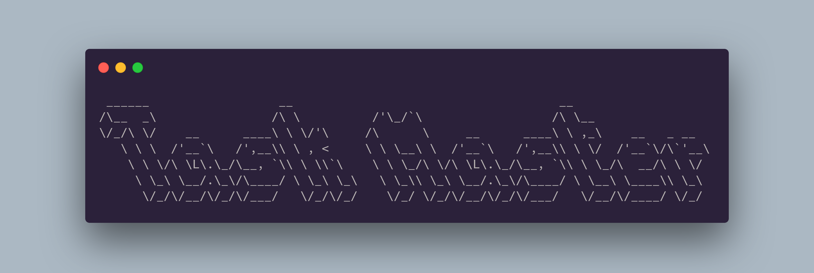

# Task Master CLI

> Your CLI to manager Your tasks

Challenge created by [DevChallenge ](https://www.devchallenge.com.br/challenges/607785ac40398e001f6046c6/details)


<div align="center">



</div>

---

## Requirements

- Python 3
- Pip
- Pipenv

## Get Started

- Clone repository

  ```bash
  git clone https://github.com/MelkdeSousa/task-master-cli.git
  ```

- Create virtualenv with pipenv

  ```bash
  pipenv --three
  ```

- Install dependencies

  ```bash
  pipenv install
  ```

- Build

  ```bash
  pipenv install -e .
  ```

- Run

  ```bash
  task-master --help
  ```

## Features

- Add task
- Complete task
- List tasks
- Next tasks
- Delete task

---

<div align="center">


</div>
